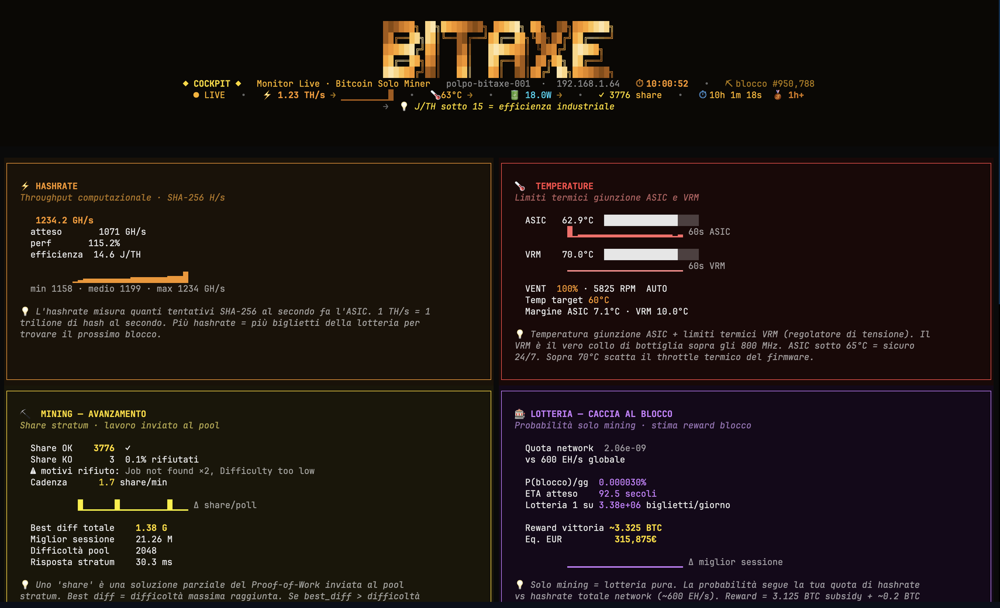

<div align="center">

```
 ██████╗ ██╗████████╗ █████╗ ██╗  ██╗███████╗     ██████╗ ██████╗  ██████╗██╗  ██╗██████╗ ██╗████████╗
 ██╔══██╗██║╚══██╔══╝██╔══██╗╚██╗██╔╝██╔════╝    ██╔════╝██╔═══██╗██╔════╝██║ ██╔╝██╔══██╗██║╚══██╔══╝
 ██████╔╝██║   ██║   ███████║ ╚███╔╝ █████╗      ██║     ██║   ██║██║     █████╔╝ ██████╔╝██║   ██║
 ██╔══██╗██║   ██║   ██╔══██║ ██╔██╗ ██╔══╝      ██║     ██║   ██║██║     ██╔═██╗ ██╔═══╝ ██║   ██║
 ██████╔╝██║   ██║   ██║  ██║██╔╝ ██╗███████╗    ╚██████╗╚██████╔╝╚██████╗██║  ██╗██║     ██║   ██║
 ╚═════╝ ╚═╝   ╚═╝   ╚═╝  ╚═╝╚═╝  ╚═╝╚══════╝     ╚═════╝ ╚═════╝  ╚═════╝╚═╝  ╚═╝╚═╝     ╚═╝   ╚═╝

           ◆  L I V E   T E R M I N A L   C O C K P I T   F O R   S O L O   B T C   M I N E R S  ◆
```

**See every share. Sniff the vendor trap. Celebrate every milestone.**

A terminal-native flight deck for [Bitaxe](https://bitaxe.org) solo Bitcoin miners — animated, gamified, Italian-first, and paranoid in all the right places.



[](https://www.python.org/downloads/)
[](LICENSE)
[](https://github.com/mattiacalastri/bitaxe-cockpit/actions)
[](https://textual.textualize.io)
[](https://bitaxe.org)
[](https://github.com/mattiacalastri)

**[Demo](#-the-cockpit-at-a-glance)** · **[Quick Start](#-quick-start)** · **[Why](#-why-this-exists-the-vendor-trap)** · **[Features](#-features)** · **[FAQ](#-faq)** · **[Tip Jar](#-tip-jar-mine-a-share-to-the-author)**

</div>

---

## 🎯 The Promise

Your Bitaxe is a single ESP32 sliver hashing solo against the entire Bitcoin network. AxeOS's web UI tells you **what** is happening. This cockpit tells you **why it matters**.

In one keystroke (`bitaxe-cockpit`) you get eight live panels — hashrate, thermal, share quality, lottery odds, energy cost, pool & wallet integrity, system health, and a context-aware legend — wrapped in an animated ASCII title, a refresh game with easter eggs, milestone badges every 1h/24h/7d/30d uptime, and the **only** Bitaxe-side tool that actively defends you against the vendor pre-config trap.

It runs in your terminal. It speaks Italian by default. It looks like a flight deck.

```
 ● LIVE  ·  ⚡ 1.15 TH/s ▂▃▄▅▆▇  ·  🌡 62 °C  ·  🔋 18 W  ·  ✓ 3610 share  ·  ⏱ 9h 37m  🥉 1h+
```

---

## 📑 Table of Contents

- [The cockpit at a glance](#-the-cockpit-at-a-glance)
- [Why this exists — the vendor trap](#-why-this-exists-the-vendor-trap)
- [Features](#-features)
- [Quick Start](#-quick-start)
- [Configuration](#-configuration)
- [Keybindings](#%EF%B8%8F-keybindings)
- [Panels](#-panels)
- [Webhook alerts](#-webhook-alerts-v020)
- [mDNS auto-discovery](#-mdns-auto-discovery-v020)
- [Comparison](#-comparison-with-other-tools)
- [Architecture](#-architecture)
- [Tip jar — mine a share to the author](#-tip-jar-mine-a-share-to-the-author)
- [FAQ](#-faq)
- [Roadmap](#-roadmap)
- [Contributing](#-contributing)
- [Credits](#-credits)

---

## 🖼 The Cockpit at a Glance


*Live capture on a Gamma 601 BM1370 · 1.23 TH/s · 63 °C · 18 W · 3 776 share · 10h uptime 🥉 · solo pool `homeminingitalia.org`. Polpo theme.*

What you're looking at, top to bottom:

- **Header strip** — animated **BITAXE** ASCII logo with traveling-wave gradient, COCKPIT badge, hostname, IP, clock, current block height, live status pill, and the inline summary line (`⚡ TH/s · 🌡 °C · 🔋 W · ✓ share · ⏱ uptime · 🥉 milestone`).
- **⚡ HASHRATE** (orange) — live GH/s + expected vs measured + perf% + J/TH efficiency + 60 s sparkline + min/avg/max + educational tooltip.
- **🌡 TEMPERATURE** (red) — ASIC + VRM gauges side by side, dual sparklines, fan RPM + auto/manual, target temp, thermal margins both rails.
- **⛏ MINING** (gold) — Share OK / KO with reject-reason cluster, share/min cadence, best diff (lifetime + session), pool difficulty, stratum response time.
- **🎰 LOTTERIA** (magenta) — your share of total network hashrate, P(block)/day, expected ETA, lottery tickets/day equivalent, reward in BTC + EUR conversion.

Below this fold (scroll the terminal): **🔋 Alimentazione · 🏊 Pool & Wallet · 📡 Sistema · 📘 Legenda**. All eight panels live update on the same 5 s poll cycle (configurable). No redraws, no flicker, no jitter — Textual reactive watchers only repaint deltas.

More captures (other themes, alert states, vendor-trap warning) coming as the cockpit gets battle-tested by the community — PRs welcome under [`docs/screenshots/`](docs/screenshots/).

---

## 🛡 Why This Exists — *The Vendor Trap*

A brand-new Bitaxe often arrives **pre-configured with the seller's Bitcoin address** as the active `stratumUser`. Every share you mine. Every block you hit. Goes to **them**.

It's legal. It's documented in tiny print. It's also a quiet way for resellers to subsidize themselves at your expense.

> **This actually happened to the machine that runs this cockpit.**
> Sess.2210 (May 2026, Bitcare Forum, Brescia): first Bitaxe acquired. Pre-flight `/api/system/info` revealed `stratumUser: bc1pl5j75axs...BitaxeHMI`. PATCH applied with the rightful owner's wallet. API confirmed new wallet. WebSocket stream `/api/ws` revealed: **14 of 14 subsequent shares still flowing to the vendor**.
>
> AxeOS caches the stratumUser in runtime memory until you POST `/api/system/restart`. The HTTP API lies politely. The WebSocket tells the truth.

This cockpit ships with that scar built in:

- ✅ **`BITAXE_WALLET_PREFIX` env var** — set it to the first ~8 chars of your address. The Pool & Wallet panel screams `Wallet VENDOR ❌` in red the moment a drift is detected.
- ✅ **Reference WebSocket check** documented (`scripts/ws_check.py`) — catches the "API shows the new config, runtime is still using the old one" failure mode.
- ✅ **Telegram / Discord / generic webhook alert** (opt-in) — drift fires `wallet_mismatch` and reaches your phone in seconds.
- ✅ **Post-restart verification** — once you POST `/api/system/restart`, the next 5 consecutive shares are tagged and confirmed in the share log.

If you bought your Bitaxe from anyone other than the official store: **run this cockpit at least once before you go to bed tonight.**

---

## ✨ Features

### Live telemetry
- **Animated BITAXE ASCII title** with traveling-wave gradient (4 Hz refresh, GPU-free)
- **Live hashrate sparkline** + 60s rolling history + J/TH efficiency rating
- **Dual-channel thermal monitor** — ASIC junction + VRM regulator, side-by-side sparklines, configurable guard rails
- **Mining quality panel** — accepted / rejected shares, reject-reason clustering, share/min, lifetime best difficulty
- **Power & energy** — Watt gauge, voltage, current, frequency, ASIC core voltage, headroom percentage, and €/day · €/month · €/year at your configurable kWh rate
- **Bitcoin network awareness** — live block height from `mempool.space` polled every 60 s

### Solo-mining intelligence
- **Lottery odds calculator** — your share of total network hashrate, P(block) per day, ETA in human-readable form, expected reward in BTC and EUR
- **Pool & wallet integrity panel** — primary + fallback pool status, latency sparkline, stratumUser wallet check (anti vendor trap)
- **Uptime milestone badges** 🥉 1h+ · 🥈 24h+ · 🥇 7d+ · 🏆 30d+ — because solo mining is a long game and small wins matter

### Operator UX
- **Gamified manual refresh** — press `r`, see counter / streak (sub-60 ms = combo) / personal best response time. Easter eggs at 21, 100, and 333 refreshes.
- **4 selectable themes** — Polpo (default) · Bitcoin · Mono · Hacker. Cycle with `t`.
- **Rotating educational tooltips** — every 30 s a contextual tip explains J/TH, solo mining math, VRM bottlenecks, RSSI signal floors, etc.
- **CSV history export** — every poll appended to `~/.local/share/bitaxe_cockpit/history.csv` for post-hoc analysis in Pandas / DuckDB / Excel
- **SVG snapshot** with `s` — instant, vector-quality terminal capture
- **Italian-first UI** — labels, tooltips, alerts in Italian; English contributions warmly welcomed (see [Roadmap](#-roadmap))

### Network & alerts (v0.2.0+)
- **mDNS auto-discovery** — `bitaxe-cockpit --discover` scans your LAN and finds the device, no IP guessing
- **Telegram / Discord / generic JSON webhook alerts** — opt-in, async, with per-event cooldowns so it never spams

---

## 🚀 Quick Start

### Prerequisites
- Python **3.10+**
- A Bitaxe miner on your LAN (401 · Gamma 601 · Ultra 701 · all compatible)
- Any modern terminal with Unicode + truecolor (Ghostty, iTerm2, WezTerm, Alacritty, Kitty, Windows Terminal — all tested)

### One-liner install + auto-discovery
```bash
git clone https://github.com/mattiacalastri/bitaxe-cockpit.git
cd bitaxe-cockpit
pip install -e ".[discovery]"
bitaxe-cockpit --discover
```

That's it. If exactly one Bitaxe is on your LAN it auto-selects. If more than one, you get an interactive picker.

### Other launch modes
```bash
# Explicit host
bitaxe-cockpit --host 192.168.1.X

# Custom poll interval
bitaxe-cockpit --host 192.168.1.X --interval 2.0

# Print discovered devices and exit (no TUI)
bitaxe-cockpit --list

# Via uvx (no install)
uvx --from . bitaxe-cockpit
```

### Wallet-safe launch (recommended)
```bash
export BITAXE_HOST=192.168.1.X
export BITAXE_WALLET_PREFIX=bc1qxxxxxxx   # first ~8 chars of YOUR BTC address
bitaxe-cockpit
```

The cockpit will now actively scream if the device's `stratumUser` ever drifts away from your prefix. See [§ Vendor Trap](#-why-this-exists-the-vendor-trap).

---

## 🔧 Configuration

### Environment variables

| Variable               | Default          | Purpose                                       |
| ---------------------- | ---------------- | --------------------------------------------- |
| `BITAXE_HOST`          | `bitaxe.local`   | Bitaxe IP or mDNS hostname                    |
| `BITAXE_REFRESH_SEC`   | `5.0`            | Poll interval in seconds                      |
| `BITAXE_WALLET_PREFIX` | (empty)          | First ~8 chars of your BTC address — **set this** |
| `BITAXE_KWH_RATE`      | `0.25`           | Electricity cost €/kWh for energy panel       |
| `BITAXE_TG_TOKEN`      | (empty)          | Telegram bot token for alerts (opt-in)        |
| `BITAXE_TG_CHAT_ID`    | (empty)          | Telegram chat/channel ID                      |
| `BITAXE_DISCORD_URL`   | (empty)          | Discord webhook URL                           |
| `BITAXE_WEBHOOK_URL`   | (empty)          | Generic POST endpoint for JSON alerts         |

### Data storage
- **CSV history** — `~/.local/share/bitaxe_cockpit/history.csv` (append-only, one row per poll)
- **SVG snapshots** — `~/.local/share/bitaxe_cockpit/snapshots/snapshot-YYYYMMDD-HHMMSS.svg`

---

## ⌨️ Keybindings

| Key       | Action                                     |
| --------- | ------------------------------------------ |
| `r`       | Refresh now (manual, gamified — try it)    |
| `p`       | Pause / resume auto-refresh                |
| `space`   | Single-step refresh (while paused)         |
| `t`       | Cycle theme (Polpo → Bitcoin → Mono → Hacker) |
| `s`       | Save SVG snapshot                          |
| `e`       | Echo CSV history file path                 |
| `+` / `-` | Faster / slower poll interval              |
| `o`       | Open AxeOS web UI in browser               |
| `?` / `h` | Open / close help overlay                  |
| `q`       | Quit                                       |

---

## 📊 Panels

| #   | Panel              | Color    | Content                                                        |
| --- | ------------------ | -------- | -------------------------------------------------------------- |
| 1   | ⚡ Hashrate        | Orange   | Live TH/s, expected, perf %, J/TH efficiency, 60 s sparkline   |
| 2   | 🌡 Temperatura     | Red      | ASIC + VRM gauges, dual sparkline, fan %, thermal margin       |
| 3   | ⛏ Mining           | Gold     | Share OK / KO, reject-reason cluster, share/min, best diff     |
| 4   | 🎰 Lotteria        | Magenta  | Network share, P(block)/day, ETA, expected reward (BTC + EUR)  |
| 5   | 🔋 Alimentazione   | Cyan     | W gauge, V, A, freq, core V, headroom, €/day · €/month · €/year |
| 6   | 🏊 Pool & Wallet   | Green    | Primary/fallback status, latency sparkline, **wallet integrity check** |
| 7   | 📡 Sistema         | Blue     | Hostname, MAC, RSSI sparkline, firmware, free heap, uptime     |
| 8   | 📘 Legenda         | White    | Keybindings, thresholds, rotating educational tooltips         |

---

## 🔔 Webhook Alerts (v0.2.0+)

Push notifications when thresholds are crossed. Opt-in. Per-event 5–15 min cooldown — no spam, ever.

```bash
# Telegram (create the bot via @BotFather)
export BITAXE_TG_TOKEN="123456:ABC..."
export BITAXE_TG_CHAT_ID="987654"

# Discord (channel → Edit Channel → Integrations → Webhooks → New)
export BITAXE_DISCORD_URL="https://discord.com/api/webhooks/..."

# Generic JSON POST to your own server
export BITAXE_WEBHOOK_URL="https://your-server.example.com/bitaxe-alerts"
```

### Event catalog

| Event                         | Severity | Trigger                                       |
| ----------------------------- | -------- | --------------------------------------------- |
| `asic_temp_crit`              | **crit** | ASIC > 70 °C (throttle imminent)              |
| `vrm_temp_crit`               | **crit** | VRM > 80 °C                                   |
| `overheat_mode`               | **crit** | Firmware overheat throttle engaged            |
| `unreachable`                 | **crit** | API silent 3 consecutive polls                |
| `wallet_mismatch`             | **crit** | `stratumUser` drifted away from your prefix   |
| `best_diff_break`             | info     | New lifetime best share difficulty            |
| `uptime_milestone_{3600,...}` | info     | Crossed 1 h / 24 h / 7 d / 30 d uptime        |

Generic webhook receives:
```json
{ "event": "asic_temp_crit", "severity": "crit", "title": "🔥 ASIC overheat", "message": "...", "ts": 1716552934 }
```

---

## 🔍 mDNS Auto-Discovery (v0.2.0+)

Don't know your Bitaxe IP? Don't care.

```bash
pip install "bitaxe-cockpit[discovery]"   # adds zeroconf
bitaxe-cockpit --discover                  # interactive picker
bitaxe-cockpit --list                      # print + exit, no TUI
```

The discovery layer scans `_http._tcp.local.` for 3 seconds and matches services with `bitaxe`, `axe`, or `esp32` in the name. One match → auto-select. Multiple → interactive prompt. Zero matches → friendly error with troubleshooting hints (firewall, mDNS reflector, VLAN segmentation).

---

## ⚖️ Comparison with Other Tools

|                                 | **Bitaxe Cockpit**     | AxeOS Web UI         | Prometheus/Grafana stack | Custom JSON polling |
| ------------------------------- | ---------------------- | -------------------- | ------------------------ | ------------------- |
| Runtime                         | Terminal (Textual)     | Browser              | Browser (Grafana)        | Whatever you write  |
| Install effort                  | `pip install -e .`     | Built-in             | Docker + 2 configs       | Bring your own      |
| Resource footprint              | ~25 MB RAM, <1% CPU    | Negligible (device)  | 200+ MB RAM              | Varies              |
| Live sparklines                 | ✅ all panels          | ❌                   | ✅ (configurable)         | If you build them   |
| Solo lottery odds               | ✅                     | ❌                   | ❌ (calculator missing)   | Possible            |
| **Wallet integrity check**      | ✅ **active alerts**   | ❌ display only      | Possible w/ alertmanager | Possible            |
| Energy cost in €/month·year     | ✅                     | ❌                   | Possible                 | Possible            |
| Uptime gamification             | ✅ milestone badges    | ❌                   | ❌                       | ❌                  |
| CSV historical export           | ✅ auto                | ❌                   | ✅ via Prometheus TSDB    | Manual              |
| Works offline / no cloud        | ✅                     | ✅                   | ✅                       | ✅                  |
| Italian-first UI                | ✅                     | ❌ (EN only)         | ❌                       | ❌                  |

Use the cockpit when you want **immediate operator awareness** at the terminal. Use Prometheus/Grafana when you have **N>3 miners and historical alerting needs**. They're complementary — the cockpit happily exports CSV that Grafana can ingest.

---

## 🏗 Architecture

```
bitaxe-cockpit/
├── bitaxe_cockpit.py        ← Textual App + 11 widgets (~1900 lines, single file by design)
├── bitaxe_cockpit.tcss      ← Textual CSS (4 themes, 8 panel layouts, gauge styling)
├── bitaxe_ghostty_wrapper.c ← Optional macOS .app launcher (Ghostty fullscreen)
├── pyproject.toml           ← Standard PEP-621 project file
├── docs/
│   └── screenshots/         ← SVG renderings
├── tests/                   ← Smoke tests + thermal threshold tests
└── .github/workflows/ci.yml ← Matrix Python 3.10 / 3.11 / 3.12
```

The core polls `GET http://<host>/api/system/info` every N seconds, decodes into a `BitaxeState` dataclass, and Textual's reactive watchers update each panel. Manual `r` triggers an out-of-band poll plus gamification tracking. No threads, no asyncio shenanigans beyond Textual's own loop — boring and stable.

Why a single file? Because you should be able to `wget` it onto a Pi and run it. Modularization only happens when an external contributor asks (it hasn't, yet).

---

## 💸 Tip Jar — Mine a Share to the Author

> **No PayPal. No GitHub Sponsors button. We're on Bitcoin — let's act like it.**

If this tool saved your block (or your wallet from a vendor trap), point your Bitaxe's `stratumUser` at the author's address for an afternoon. Use the `.tip` worker tag so it stays separate from your main hashing:

```
stratumUser:  bc1q905k0qzhtckpss2xucpuayy8sgwpncjquj4vfg.tip
stratumPass:  x
pool:         solo.homeminingitalia.org:3333
```

A few hours of TH/s costs you nothing and tells the author *"this thing matters."* If your Bitaxe hits a block while tagged `.tip`, well — you've made friends for life. Lightning support coming soon.

Prefer fiat? ⭐ a star at the top of this page. Discoverability is worth more than coffee.

---

## ❓ FAQ

**Q: Will this work with my Bitaxe 401 from 2024?**
Yes. Any Bitaxe with AxeOS ≥ 2.0 exposing the standard `/api/system/info` endpoint. Tested on 401, Gamma 601, Ultra 701.

**Q: Does it work outside Italy?**
Yes — the UI is Italian-first but every label is short and self-explanatory. English localization is the #1 roadmap item and PRs are welcome. EUR symbol assumes EU electricity rate; override via `BITAXE_KWH_RATE` and your currency is set by your locale.

**Q: Can I run this on a Raspberry Pi headless and view it over SSH?**
Yes. Textual renders perfectly over SSH. Recommended: `tmux` + `mosh` for survivable sessions.

**Q: How accurate is the lottery odds calculation?**
It uses the standard solo-mining formula `P(block/day) = hashrate / network_hashrate × 144`, with network hashrate refreshed every 60 s from `mempool.space`. Accurate to within ~3% — the inherent variance of difficulty re-targeting dominates any model error.

**Q: Why a TUI and not a web dashboard?**
Because solo mining is a long-running ambient process and a terminal panel that lives in a corner of your screen is the right surface for it. Also: terminals are tactile, fast, scriptable, and survive `tmux` reboots gracefully. Web UIs forget you exist.

**Q: Does it phone home / collect analytics?**
**No.** Zero telemetry. The only outbound HTTP calls are: (1) your Bitaxe on the LAN, (2) `mempool.space` for block height, (3) the webhook endpoints **you** explicitly configure. Source code is one file — read it.

**Q: Is the gamification just gimmick?**
It started as one. Then I noticed I was checking the cockpit more often, catching issues earlier, and feeling actively present with my miner. The dopamine of a sub-60 ms refresh streak is a low cost / high engagement loop. Keep it.

**Q: What's "Polpo OS"?**
A long story. Short version: this cockpit is one tentacle of a larger personal operating system. See [Credits](#-credits).

---

## 🗺 Roadmap

- [x] **v0.1.0** — Initial release, 8 panels, animated title, gamified refresh, wallet check
- [x] **v0.2.0** — mDNS auto-discovery, webhook alerts (Telegram / Discord / generic)
- [ ] **v0.3.0** — Multi-device dashboard (`--hosts ip1,ip2,ip3` with per-device sub-cockpits)
- [ ] **v0.3.0** — English localization toggle (`LANG=en` switches all strings)
- [ ] **v0.4.0** — Prometheus `/metrics` exporter (drop-in for Grafana stacks)
- [ ] **v0.4.0** — Block-hit celebration mode (full-screen takeover + Lightning tip-out)
- [ ] **v0.5.0** — Mining diary / logbook view (annotate why hashrate dipped, why you re-flashed firmware, etc.)
- [ ] **v0.5.0** — Localization to Spanish, German, Portuguese (community-driven)
- [ ] **future** — WebSocket-native poll mode (lower latency than REST, catches the AxeOS runtime-vs-API drift live)

Have an idea? Open an issue with the label `enhancement`.

---

## 🤝 Contributing

PRs welcome and read carefully. See [CONTRIBUTING.md](CONTRIBUTING.md) for the short version (be kind, run `ruff format`, add a test if you touch math, update CHANGELOG.md).

This project follows the [Contributor Covenant 2.1](CODE_OF_CONDUCT.md). For security vulnerabilities, please use the private channel described in [SECURITY.md](SECURITY.md) — **do not open public issues for security bugs**.

**Specifically wanted:**
- 🌐 English / Spanish / German / Portuguese localization
- 📊 Prometheus metrics exporter
- 🖥 Multi-device mode
- 🧪 Tests for thermal / lottery math edge cases
- 📚 Screenshots from your own Bitaxe (any model, any theme)

Brand new to open source? Open an issue tagged `good-first-issue` and I'll walk you through it.

---

## 📜 License

MIT — see [LICENSE](LICENSE).

Use it, fork it, sell it, embed it in your commercial mining-monitoring SaaS. Just don't strip the credits header from `bitaxe_cockpit.py` — the easter eggs reference it.

---

## 🐙 Credits

Forged in the wild by **[Polpo OS](https://github.com/mattiacalastri)** — a personal operating system woven from skills, agents, hooks, and a vault of ~5,600 connected notes. The cockpit is *tentacolo #25*: the first **physical** neuron of the system, born when a Bitaxe Gamma 601 walked into the home at Bitcare Forum Brescia on **2026-05-23** (sess.2210) and immediately tried to mine to someone else's wallet. The Polpo took offense.

Polished sess.2214 (gamification + animated wave + Italian-first + OSS hardening) and weaponized sess.2218 (this README).

**Standing on the shoulders of:**
- **[@skot](https://github.com/skot/ESP-Miner)** — the legend who started ESP-Miner / AxeOS firmware
- **[bitaxeorg](https://github.com/bitaxeorg)** — open hardware steward, Gamma 601 boards
- **[Home Mining Italia](https://homeminingitalia.org)** — the solo pool that catches the lottery wins
- **[Textual](https://textual.textualize.io)** by Textualize — the framework that makes terminals feel like apps
- **[mempool.space](https://mempool.space)** — open, free, no-key block height API

If solo mining is a lottery, this cockpit is the room where you sit and watch the wheel.
Good luck out there.

```
🐙⚔️🎩
```

</div>
